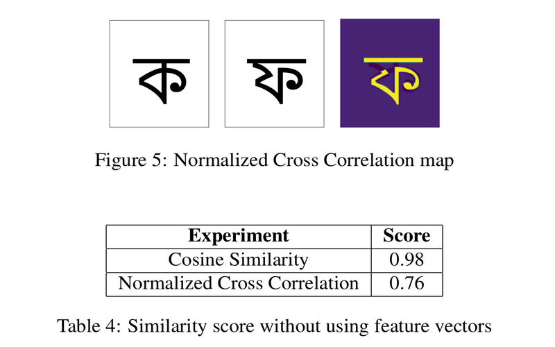

# Character Similarity
Experimentation between different similarity metric and various feature vectors in order to detect similarity between two characters. Architecture and experimental results are described in the paper `Character_Similarity_paper.pdf`. For additional information and dataset feel free to reach me at <imranul.ashrafi@gmail.com>.

